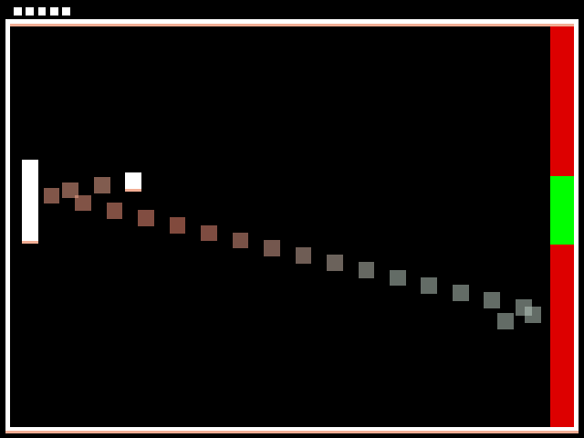

# Target Pong

Author: Kishan Patel

Design: Instead of playing against an AI hitting the ball back against you, the goal of the game is to aim the Pong ball into a moving green target area to score points.
As you score more points, the ball will increase in speed, the target area will speed up, and the target area will decrease in size.

Screen Shot:

How To Play:

The controls are identical to the original pong game, where the player controls the left paddle with mouse movement within the game screen.
Every 3 points, the target area speeds up, and every 5 points, the target area decreases in size. The ball speeds up every 5 points to make it more feasible to hit the target area.
The target area velocity and size have a capped maximum and minimum, respectively, as well as a maximum velocity for the ball.

Sources: None

This game was built with [NEST](NEST.md).
